# 🛡️ SOCShield - AI-Powered Security Operations Center Dashboard

## Overview

SOCShield is an AI-powered Security Operations Center (SOC) Dashboard developed using Python and Streamlit for cybersecurity threat monitoring, investigation, alert management, and incident reporting.

The platform processes cybersecurity log data and provides real-time security insights through threat analytics, anomaly detection, risk scoring, network visualization, and investigation workflows.

---

## Features

### Threat Analytics

* Threat distribution analysis
* Malicious event monitoring
* Suspicious activity tracking
* Threat trend analysis

### Risk Assessment

* High-risk IP identification
* IP risk scoring engine
* Threat severity classification

### Detection Modules

* Anomaly detection
* Brute force attack detection
* Security alert generation

### Investigation Tools

* Investigation panel
* Source IP analysis
* Destination IP analysis
* Protocol analysis
* Analyst notes management

### Visualization

* Attack network graph
* Threat trends dashboard
* Interactive security metrics

### Reporting

* Incident report generation
* PDF report export
* Alert history storage using SQLite

---

## Technology Stack

* Python
* Streamlit
* Pandas
* NumPy
* Scikit-Learn
* SQLite
* NetworkX
* Matplotlib
* ReportLab

---

## Dataset

Cybersecurity Threat Detection Logs Dataset

* Original Dataset Size: ~6,000,000 records
* Dashboard Working Dataset: ~100,000 records

---

## Project Architecture

Cybersecurity Logs Dataset

↓

Log Loader Module

↓

Threat Analysis Engine

* Threat Statistics
* IP Analysis
* Protocol Analysis
* Risk Scoring
* Anomaly Detection
* Brute Force Detection

↓

SOCShield Dashboard

* Threat Trends
* Investigation Panel
* Security Alerts
* Network Visualization
* Analyst Notes

↓

SQLite Database

* Alert History
* Analyst Notes

↓

Incident Reports & PDF Export

---

## Project Structure

socshield-ai-soc-dashboard/

* app.py
* requirements.txt

data/

* cybersecurity_threat_detection_logs.csv

modules/

* log_loader.py
* threat_statistics.py
* ip_analysis.py
* protocol_analysis.py
* threat_scoring.py
* anomaly_detection.py
* investigation.py
* brute_force_detector.py
* network_visualization.py
* alert_engine.py
* threat_trends.py
* analyst_notes.py
* report_generator.py

database/

* alerts.db
* db_manager.py

reports/

* socshield_report.pdf

screenshots/

---

# Dashboard Screenshots

## Dashboard Overview

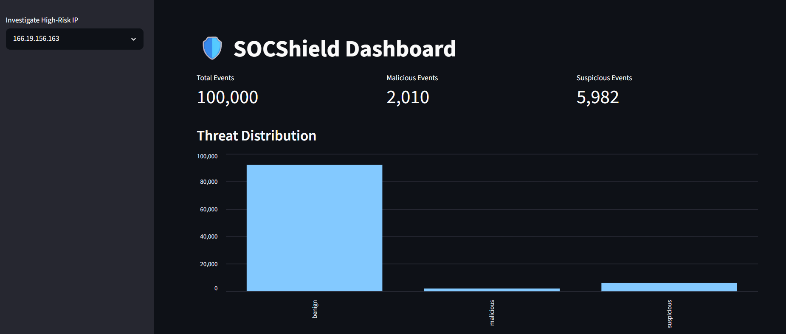

---

## High-Risk IP Analysis

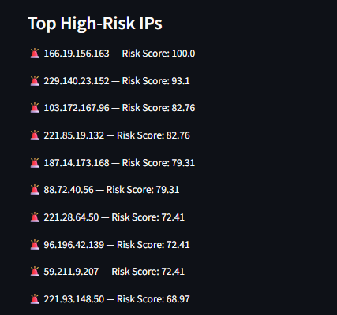

---

## Investigation Panel

### Investigation Dashboard

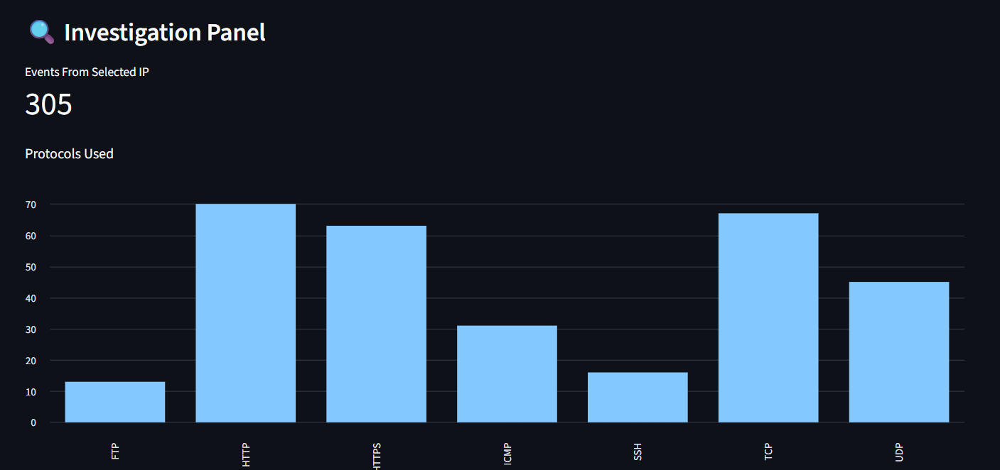

### Protocol Analysis

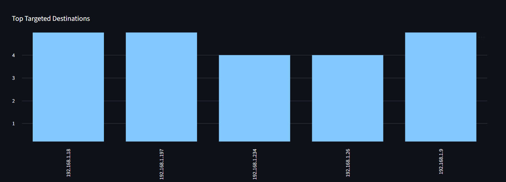

### Recent Activity Analysis

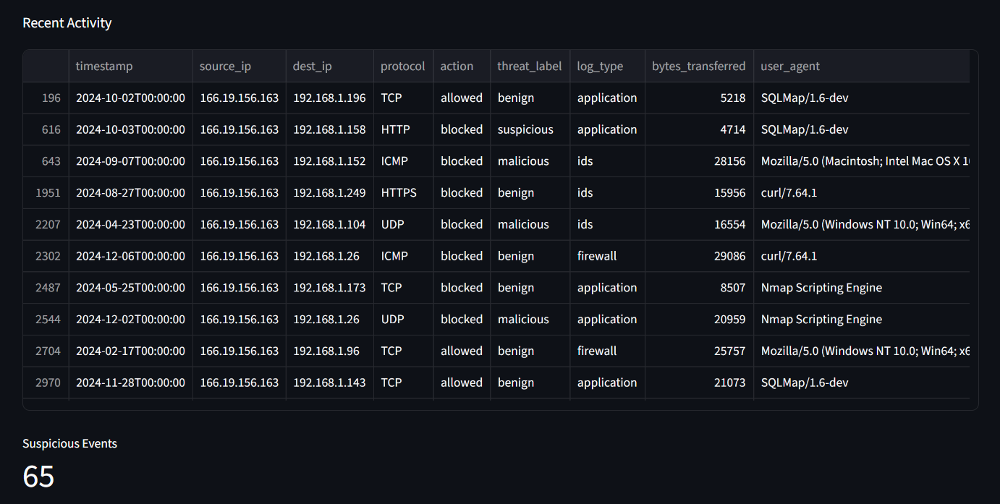

---

## Anomaly Detection

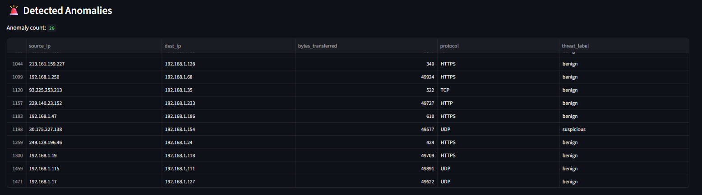

---

## Brute Force Detection

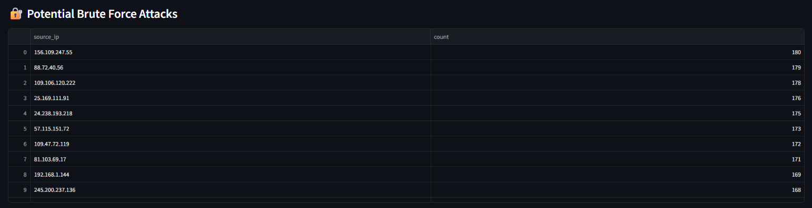

---

## Security Alerts

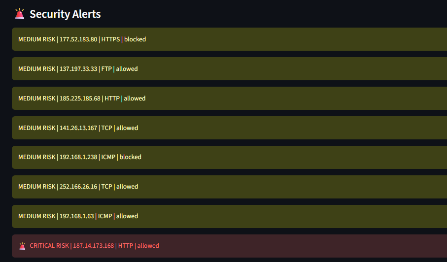

---

## Alert History

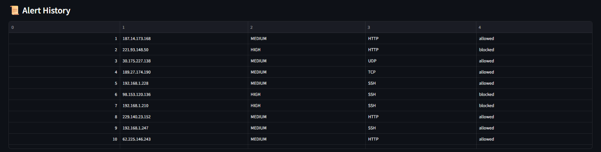

---

## Network Visualization

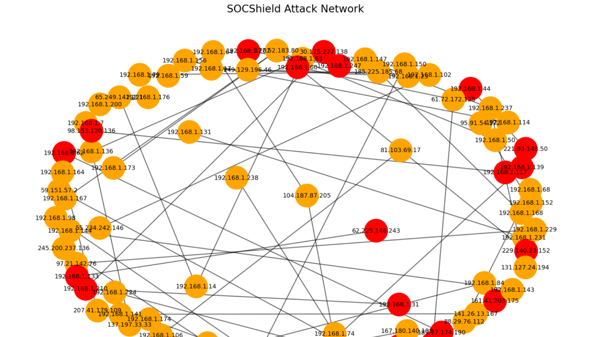

---

## Threat Trends

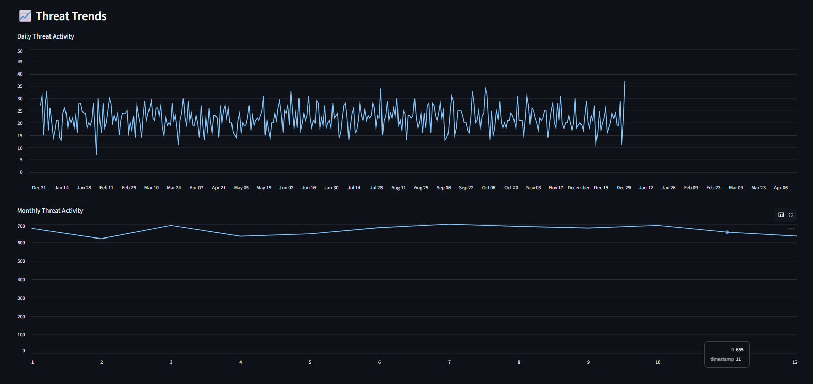

---

## Analyst Notes

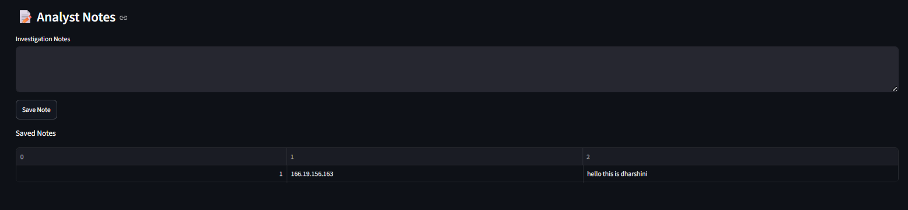

---

## Incident Report Generator

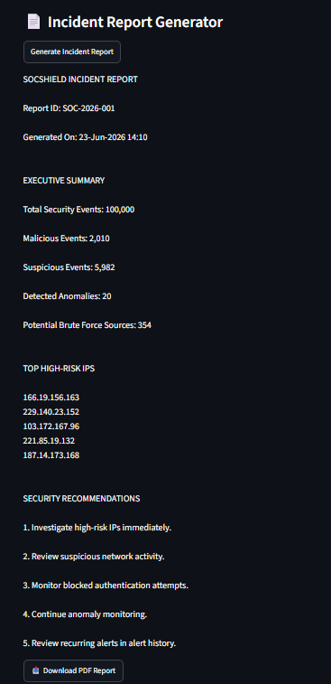

---

## Installation

```bash
pip install -r requirements.txt
streamlit run app.py
```

## Future Improvements

* Real-time threat monitoring
* Threat intelligence integration
* SIEM integration
* Cloud deployment
* Advanced attack correlation

## Author

Dharshini

PES University

Cybersecurity & AI Forensics Internship Project


